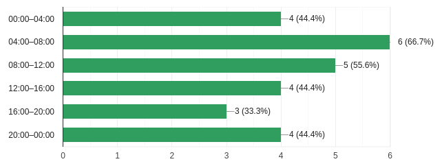
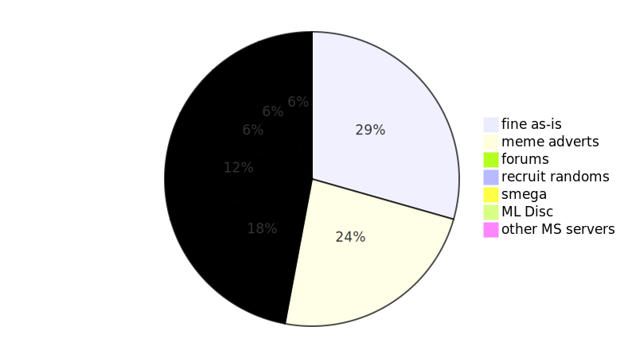

# What’s next for Oddjobs? Survey results

Total response count: 8

## What should we do next? (select all that apply)


Responses here are pretty spread out, so any of the original three options ([SPQ](https://maplelegends.com/lib/map?id=990000000), [Pap](https://maplelegends.com/lib/monster?id=8500001), [Rav](https://maplelegends.com/lib/monster?id=9420014)) could work.

Someone [wrote in](https://en.wikipedia.org/wiki/Write-in_candidate) [Zakum](https://maplelegends.com/lib/monster?id=8800000), which could work as well. The only serious issue (AFAIK) with Zakum runs in general (including e.g. a single-[arm](https://maplelegends.com/lib/monster?id=8800003) run as a kind of Zak run) is Zak’s sheer level. Zakum is level 140, so you need to be level ≥135 to get EXP, and level ≥140 to not take any combat penalties. But something more modest like a single-arm run is likely doable, given that something like Rav is doable.

“[BF](https://maplelegends.com/lib/monster?id=9400575) suicide runs” and [HH](https://maplelegends.com/lib/monster?id=9400549) were added as a write-in as well. I’m not sure if the BF suicide runs were a joke, but depending on any given character’s job/level, actually “properly” fighting BF (and mayhaps dying occasionally) is doable… Both BF and HH are **area bosses**; that means that, in this case, it’s basically a matter of checking [FP](https://maplelegends.com/lib/map?id=610010005) and, if one finds anything there, calling for reinforcements from whoever is online at that time.

### Other ideas

- [Capt. Latanica](https://maplelegends.com/lib/monster?id=9420513) is a classic favourite, and is a proper boss (not an area boss). No level requirement to participate, level ≥95 for EXP, level ≥100 for no combat penalties. Capt. Lat hits for like ≈2k-ish with touch attacks, but more like ≈4k-ish with magical attacks. It’s pOsSiBLe to dodge the magic attacks by hugging Capt. Lat the entire time, but this plan basically falls apart once you clear the non-boss monsters that he spawns.
- SPQ is the obvious PQ choice, as it’s guild-based and, more importantly, has no real requirements to participate. Other PQs, for better or worse, tend to have strict level requirements. That being said, PQs are still very much worth looking into:
    - [APQ](https://maplelegends.com/lib/map?id=670010100) has the loosest level requirement: level ≥40. But, it also requires everyone in the party to be married, and also requires the party size to be exactly 6. It’s otherwise very doable; the boss fight is a _massive_ PITA, but not difficult numbers-wise. [Grog](https://maplelegends.com/lib/monster?id=9400514) has reasonably low HP, doesn’t hit all that hard, and is just level 95.
    - [PPQ/MLGPQ/HTPQ](https://maplelegends.com/lib/map?id=251010404) is level 55–100, which is a fairly wide level range for a PQ, but still excludes many, if not most, characters. But, most people _probably_ have at least one character in this range, so that’s nice.
    - [LPQ](https://maplelegends.com/lib/map?id=221024500) is level 35–50, and requires a party of 5–6 characters.
    - [EPQ](https://maplelegends.com/lib/map?id=930000600) is level 45–55, and requires a party of 3–5 characters (signing is possible, as the entire PQ can be soloed).
    - [OPQ](https://maplelegends.com/lib/map?id=200080101) is level 51–70, and requires a party of 5–6 characters.
    - [LMPQ](https://maplelegends.com/lib/map?id=220000000) is level 51–70 as well, but requires a party of just 3–6 characters.
    - [MPQ/R&JPQ](https://maplelegends.com/lib/map?id=261000021) is level 71–85, and requires a party of exactly 4 characters (signing is possible, as the entire PQ can be completed with as few as 2 characters).
- **Red** suggested partnering with some of the folks from the **Dreamville** alliance (viz. the **GangGang** and **Chroma** guilds) to do some mixed runs — “mixed” in the sense of not necessarily being 100% odd-jobbers. Although this isn’t _fully_ in the spirit of what we’re talking about here, it’s still important to consider, and could be really helpful, as it accustoms us to doing these kinds of runs (like Papulatus, for example). Being more used to the partying vibe would then make it easier to schedule & perform all-odd-job runs. Plus, it’s fun, right?

## What are good times for you? (select all that apply) (times are in server time = ST = [UTC](https://en.wikipedia.org/wiki/Coordinated_Universal_Time) = [GMT](https://en.wikipedia.org/wiki/Greenwich_Mean_Time))



<details>
<summary>Raw CSV for “What are good times for you?”</summary>

```csv
timeframe,response count
00:00–04:00,3
04:00–08:00,5
08:00–12:00,5
12:00–16:00,3
16:00–20:00,3
20:00–00:00,4
```

</details>

Again, the responses are pretty spread out here, which is perhaps unfortunate, but to be expected — **Oddjobs** is not a guild with a geographical centre. That being said, the [modal][mode] response was essentially 04:00–12:00, so that’s good to know.

### Other ideas

- Maybe, it might make sense to schedule just… “stuff”, on a regular basis. I’m not sure what that basis would be — maybe picking out two times per week, or something. Then, we can “do the run(s)” if enough people can actually confirm (in-game and/or in the Discord); if not enough people confirm, then that’s fine, we don’t _have_ to do anything. The obvious target here is weekends. It doesn’t even have to be a fixed activity (e.g. “_Ravana_ on Saturday @ 06:00”), it could just be nebulous (or a wide selection of things), and then an activity can be chosen once people actually confirm.

[mode]: https://en.wikipedia.org/wiki/Mode_(statistics)

## How do you feel about Oddjobs recruitment? (select all that apply)



To my surprise, the modal response here is just “Oddjobs membership/recruitment is fine as-is”. Maybe that’s a good thing. On the other hand, it’s no secret to anyone that we have trouble being an “active” guild/alliance. And that’s not even “active” in any particularly demanding sense; putting together anything… any kind of “just playing together”… it’s tough. In many cases, there’s just no one online — no one to chat with in ally/guild chat. And, part of the reason that I made this survey is as part of an initiative (if you will) to revitalise the odd job MapleStory community. One of the write-in responses to this question points out that playing odd jobs in MapleStory is inherently niche, and that as a result, outreach/recruitment is unlikely to have a large effect. Of course, this is true; it is a niche. _However_, making that niche larger (as niches come in all shapes and sizes) is something that I’m interested in, and to that end, we might ask what exactly the [target audience](https://en.wikipedia.org/wiki/Target_audience) is here:

- People who already play odd-jobbed characters on MapleLegends, but are either guildless, or part of a generalist guild that doesn’t specialise in odd gameplay whatsoever. This, by the way, accounts for a considerable portion of the current Oddjobs roster.
- People who already play MapleLegends, haven’t genuinely experimented with odd jobs, and are open to the idea. We can expect that not everyone who tries an experience for the first time will find that experience worthwhile, which is okay.
- People who don’t really habitually play [MapleStory](https://en.wikipedia.org/wiki/MapleStory) at the moment, but have played it in the past (or play it very sporadically), and want to get back into it. These people may have experimented with “alternative gameplay styles” in the past, or may just be looking for something fresh.
- People who already play odd-jobbed characters, but not on MapleLegends.
- People who play MapleStory, don’t play MapleLegends, haven’t genuinely experimented with odd jobs (or have, but only in the past), and are open to the idea of playing an odd-jobbed character with other like-minded players on MapleLegends.
- People who don’t really habitually play MapleStory, don’t have significant experience with MapleStory from their past, but do have significant experience playing [MMOG](https://en.wikipedia.org/wiki/Massively_multiplayer_online_game)s (or even single-player videogames, perhaps(??)) with self-imposed restrictions and/or unusual playstyles/builds.

**⚠️ IMPORTANT NOTE ⚠️:** Please be polite and respectful when it comes to other MapleStory servers. With Necksawn-operated/Necksawn-published ones (GMS, MapleSEA, etc.), this is less of an issue (just don’t get banned, if you care about that). With private servers, please be respectful, and careful to not _brazenly_ advertise another server (MapleLegends). Have some tact, and don’t go around breaking server rules willy-nilly. If applicable, you can even ask for permission.

With this target audience in mind, the most popular response to this survey question (besides “Oddjobs membership/recruitment is fine as-is”) is the [marketing](https://en.wikipedia.org/wiki/Marketing)-style smegas. The example that I gave was of a kinda meme-y smega: “i am a level 112 mage with 560 base LUK. ask me anything”. This example is, of course, just one possible route to go down. Feel more than free to help out with any other ideas! With respect to smegas generally (well, I suppose this applies to other recruitment media as well, not just smegas), I want to make it clear that **I (deer) don’t have to be the one doing all the recruiting/marketing**. Feel free to send out some smegas yourself, post on the ML forums, reach out to MapleStory servers that you’ve played in the past, etc., etc.

The other options that got more than one vote are: using the ML forums, and recruiting random people in-game (generally via PQs like LPQ, OPQ, etc.). With respect to the ML forums, there are basically three locations, as far as I can tell:

- The recruitment section, wherein lies [the Oddjobs recruitment thread](https://forum.maplelegends.com/index.php?threads/oddjobs.34994/). The thread already exists, of course, and has long existed, but justifiable bumps to the thread (to bring it to the top of the forum) are very welcome :)
- Of course, the [Odd Jobs Community Thread](https://forum.maplelegends.com/index.php?threads/odd-jobs-community-thread.36495/). I already mentioned this in the Oddjobs Discord, but it really does bear repeating: **Feel more than free to post anything odd-job-related in the community thread! It doesn’t have to be terribly substantial — even a simple comment or dumb meme is more than good enough!**
- It may (or may not) make sense to mention odd-job-related stuff elsewhere in the ML forums. Obviously, don’t go around brazenly advertising any guilds (Oddjobs, Flow, etc. included) where it’s inappropriate and/or annoying. But, where applicable, not every single mention of anything odd-job-related necessarily has to be confined to the above two threads.

When it comes to recruiting random people in-game, that is of course an important route for recruitment. I think this route basically happens “naturally”, so there’s not much to say about it. The only thing I can think of is: consider the possibility, if and when anyone asks you about your character build or your guild, that you can offer those people the opportunity to try it themselves. Oh, and do more PQs, if you like. That might help. :)
